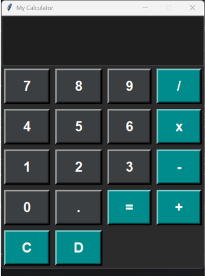

# 💻 Stylish Tkinter Calculator (v1.0)
A modern, dark-themed calculator built with **Python 3** and **Tkinter**. This first version focuses on a clean, functional UI for basic arithmetic operations.

## ✨ Features (v1.0)
* **Dark Modern UI:** Aesthetic and easy on the eyes.
* **Intuitive Design:** Large display area and bold, easy-to-press buttons.
* **Core Arithmetic:** Supports `+`, `-`, `×`, `÷`, and decimals (`.`).
* **Utility Functions:** Dedicated **Clear (C)** and **Backspace (D)** buttons.
* **Robust Layout:** Fully responsive grid layout, providing perfect alignment.
* **Stability:** Built-in basic error handling to manage invalid expressions.
* **Fixed Size:** Non-resizable window for consistent UI integrity.

---

## 🖥️ Screenshot



---

## 🚀 Getting Started

To run this project locally, follow these simple steps:

### Prerequisites
You need **Python 3.x** installed. Tkinter is typically included with standard Python installations.

### Installation and Execution
1.  **Clone the repository:**
    ```bash
    git clone https://github.com/shanuz123/calculator-python.git
    ```

2.  **Navigate into the project folder:**
    ```bash
    cd calculator-python
    ```

3.  **Run the program:**
    ```bash
    python 'Calculator Project.py'
    ```

---

## 🧠 How It Works (Technical Overview)

The application relies on standard Python practices for GUI development and calculation:

* **UI Management:** The **Tkinter** library is used exclusively for creating the window, display, and buttons.
* **Expression Handling:** A **`StringVar`** is used to dynamically store and update the current mathematical expression displayed in the Entry widget.
* **Calculation:** The built-in **`eval()`** function is used to securely evaluate the string expression within a robust `try/except` block for error handling.
* **Layout:** The **`grid()`** geometry manager is utilized to create a clean, organized, and perfectly aligned button layout.
* **Styling:** Buttons are managed using distinct style configurations for **normal numbers**, **operators**, and **utility functions** (Clear, Backspace, Evaluate).

---

## 🛠️ Technologies
| Technology | Type |
| :--- | :--- |
| **Python** | Primary Language |
| **Tkinter** | GUI Library (Built-in) |

---

## 📅 Roadmap

### Version 2 – Keyboard Support
* Implement numerical key input (0-9).
* Map `Enter` key to the **Evaluate (=)** function.
* Map `Backspace` key to the **Delete/Backspace (D)** function.
* Map `ESC` key to the **Clear (C)** function.
* Full support for `+`, `-`, `*`, `/`, and `.` keys.

### Version 3 – Percentage (%) Support
* Add a dedicated **%** button.
* Implement common percentage math (e.g., `50%` = `0.5`, `200 + 10%` = `220`).

### Future Versions (V4+)
* **V4:** Theme Toggle (Light/Dark themes).
* **V5:** History Panel (Sidebar/popup for previous calculations).
* **V6:** Hover Effects (On-hover color changes with smooth transitions).
* **V7:** Sound Effects (Click sounds with toggle option).

---

## 🤝 Contributing
Contributions are what make the open-source community such an amazing place to learn, inspire, and create. Any contributions you make are **greatly appreciated**.

1.  Fork the Project
2.  Create your Feature Branch (`git checkout -b feature/AmazingFeature`)
3.  Commit your Changes (`git commit -m 'feat: Add some AmazingFeature'`)
4.  Push to the Branch (`git push origin feature/AmazingFeature`)
5.  Open a Pull Request

---

## 📜 License
Distributed under the **MIT License**. See `LICENSE` for more information.

---

## 👤 Author
**Shanavas Shafi**
* Python & Cybersecurity Learner
* GitHub: (https://github.com/shanuz123)
